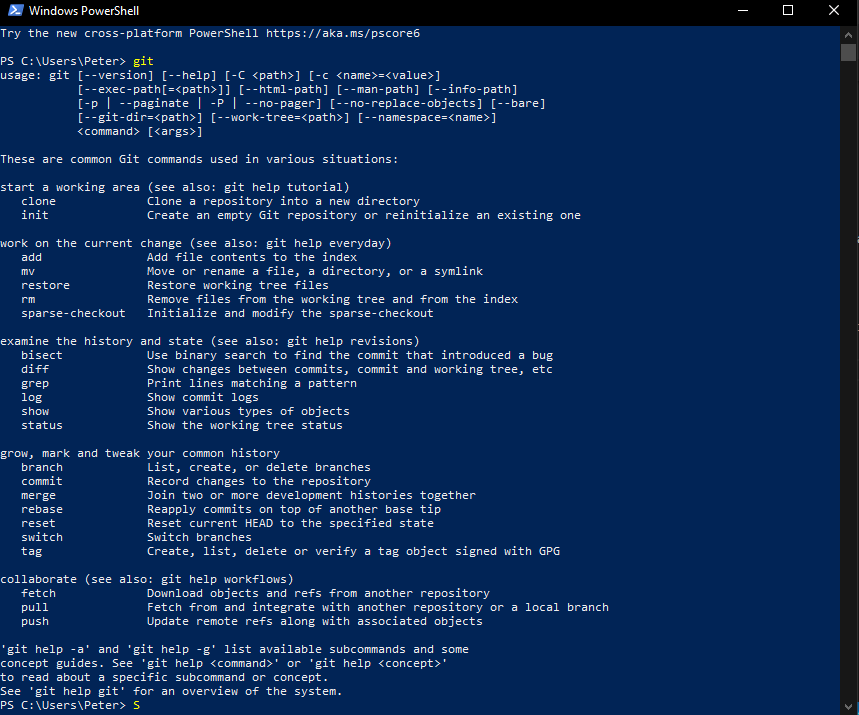
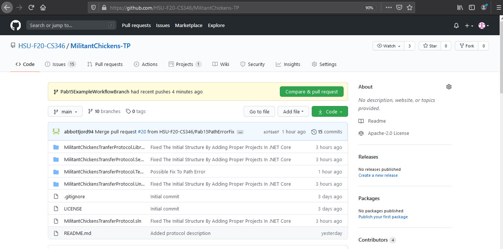

# Guide To Github Workflow - Pab15 

In this guide, I will lay out how I personally use git/github to:
- Create branches
- Commit to branches
- Push from branches
- Create a pull request

##### Follow this guide to avoid:

---

## Powershell:
Note: This section only applies to windows, for MacOS and Linux, Git should be installed automatically.
- If you haven't already, [download git](https://git-scm.com/download/win) 
- Follow the install directions
- Once completed, verify that Git is installed by opening powershell and running `git` in the shell. The output should match the output provided below:

---

## Creating a branch:
- In Powershell or Terminal, navigate to the cloned repository file
- To create the branch, run `git checkout -b <username+briefdescription>`. An example is provided below:

- Congrats! You created a new branch, and are now working under that branch.

## Commiting and pushing changes:
Note: DO NOT commit any changes unless you are working in a new branch
- First, make sure that you have staged your changes by running the command `git add .`
Note: You will not see any output from this command, do not be alarmed.
- Next, commit your changes by running `git commit -m "<commit message>"` 
Note: Be as descriptive as possible with your commit messages, but short enough that it will be within the commit message size.
- Finally, push your changes by running `git push`

## Creating a pull request:
- Once you have pushed your changes, navigate to the github site where the main folder of the project is located. You should see something like this:

- Next, click on "Compare & pull request". You should see a page like below:

- If you do not see the message "Able to merge. These branches can be automatically merged.", STOP. Do not attempt to merge.  
- If you do see the message, add a more descriptive comment and click on "Create pull request". You are now done, and whoever manages the pull requests can now review your request and merge. DO NOT merge your PR without review from the manager. This can mess a lot of things up.

## To pull from the main branch:
 - Navigate to the repository folder in Powershell
 - run `git branch --set-upstream-to=origin/main`
 - run `git pull`
 This should pull all recent changes from the main branch.
